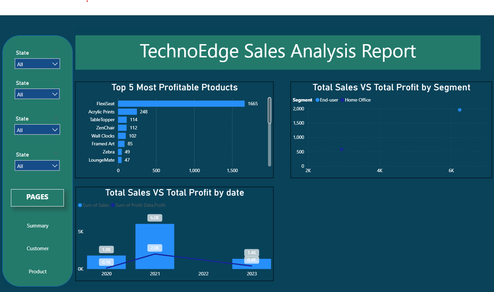

<<<<<<< HEAD
## TechnoEdge Sales Analysis (Power BI)

A compact, business-ready Power BI project showcasing end‑to‑end analytics for TechnoEdge’s sales across regions, customers, and products (2020–2023). The report highlights KPIs (Sales, Profit, Quantity), customer and product performance, and operational insights.

## Report Preview

## Project Requirements (What this delivers)
- Scope: Summary, Customer, and Product pages covering orders, customers, products, and profit trends.
- Objectives:
  - Analyze sales by region/country/category and detect trends and outliers.
  - Understand customer behavior (top customers, retention indicators) and product performance.
  - Monitor sales, profit, and margins to guide strategic actions.
- Skills: Power BI (Power Query, Data Modeling, DAX, Visual Design), data viz best practices, stakeholder communication.
- System: Windows + Power BI Desktop; standard hardware (≥1 GB disk, 1024×768 display).

## Solutions Summary (answers to each task)

### A) Data Cleaning (Power Query)
1) Append Sales 2020–2023 into one table
   - Home > Append Queries > Append as New > select 2020–2023 tables (same schema) > OK. Rename to `Sales`.
2) Merge Profit into Sales
   - Home > Merge Queries > select `Sales` and `Profit` tables > choose common key(s) (e.g., Order ID/Product ID as applicable) > Join > expand the merged column to include `Profit`.
3) Set data types for all columns
   - Transform > Detect Data Type (or select all columns > Data Type) and confirm/correct Date, Whole Number, Decimal Number, Text, Boolean as needed.
4) Remove duplicates
   - Select key columns (e.g., Order ID + Line ID) > Home > Remove Rows > Remove Duplicates.
5) Remove nulls
   - Apply column filters to exclude null/blank where required (e.g., Order Date, Product, Sales not null).
6) Add index as Sr. No.
   - Add Column > Index Column (From 1) > rename to `Sr. No.`
7) Fill down
   - Select columns with gaps (e.g., Category/Region) > Transform > Fill > Down.
8) Replace values with blank
   - Transform > Replace Values… > specify target values > replace with a single space " ".
9) Derive date parts from Order Date
   - Add Column > Date > Year; Month; Start of Month; Name of Month; Day. Rename as `Year`, `Month`, `StartOfMonth`, `MonthName`, `Day`.
10) Conditional column for Profit band
   - Add Column > Conditional Column > rule on Profit (e.g., Profit <= 0 = "Low Profit", else "High Profit").

### C) Data View (Geography)
1) Geographic datasets on a map
   - Use Map/Filled Map visual; assign City, State, Country, Region; set Data Category on each column (Model view) to the correct geographic role.

### D) Visual Insights (Report)
1) Total Sales trend (2020–2023) as a Card
   - Card visual with measure `Total Sales`; add Year slicer or use date hierarchy on the page.
2) KPI cards: Total Sales, Net Profit, Total Customers, Total Quantity
   - Four Card visuals with respective measures.
3) Order count ratio by Category (Pie)
   - Pie visual: Legend = Category; Values = Order Count.
4) Top‑5 and Bottom‑5 products (Stacked Bar)
   - Bar chart with Product on axis; Sales as value; use Top N filter (5) and a duplicate visual with Bottom N (5). Enable tooltips.
5) Net Profit trend (Line) with date hierarchy
   - Line chart: Axis = Date hierarchy; Values = Net Profit; enable drill (Month/Quarter/Year).
6) Top 10 customers by profit per country (Table)
   - Table: Customer, Country, Profit; apply Top N (10) by Profit; add Country as group or use slicer.
7) Sales distribution by product category (Stacked Bar)
   - Axis = Category; Values = Sales; Series = Sub‑Category (optional) for composition.
8) Profit margin by category (Stacked Column)
   - Column chart: Axis = Category; Values = Margin% (DAX measure) or Profit/Sales.
9) Donut with percentage labels
   - Donut: Category as Legend; Sales as Values; enable Data labels and set to % of total.
10) Profitability of Top 5 products (Stacked Bar)
   - Bar chart filtered to Top N (5) by Profit; Values = Profit (and optional breakdown by Segment).
11) Sales and Profit trend (Line and Stacked Column)
   - Combo chart: Column = Sales; Line = Profit; Axis = Date hierarchy.
12) Sales vs Profit by Segment (Scatter)
   - Scatter: X = Sales; Y = Profit; Details = Segment (or Product/Customer); add annotation via Text box.

### E) Publishing
- Home > Publish from Power BI Desktop to your workspace. Share report/app with stakeholders and manage access.

## Design & UX Guidelines
- Page size 16:9; View = Fit to page
- Font: Segoe UI Light; Title size ~16
- Background: image with color palette
  - #00425A (Page background)
  - #187A6B (Title background)
  - #FFFFFF (Text)
  - #044B5C (Visual background)
- Visuals used: Cards, Slicers, Bar/Column, Line, Line+Column, Scatter, Donut, Pie, Table

## Repository Contents
- `Sales Analysis project - BI.pbix` – Power BI report
- `Solution-Sheet/` – Original overview and solution docs
- `resources/` – Project overview and solution text references

## Run the Report
1) Open `Sales Analysis project - BI.pbix` in Power BI Desktop (Windows).
2) If prompted, refresh to load model and visuals.

—
This README summarizes the problem statement, approach, and exact build steps to reproduce the analysis quickly for evaluation.
=======
>>>>>>> 240bd40 (refactored the readme instructions and attached an image with the findings)
